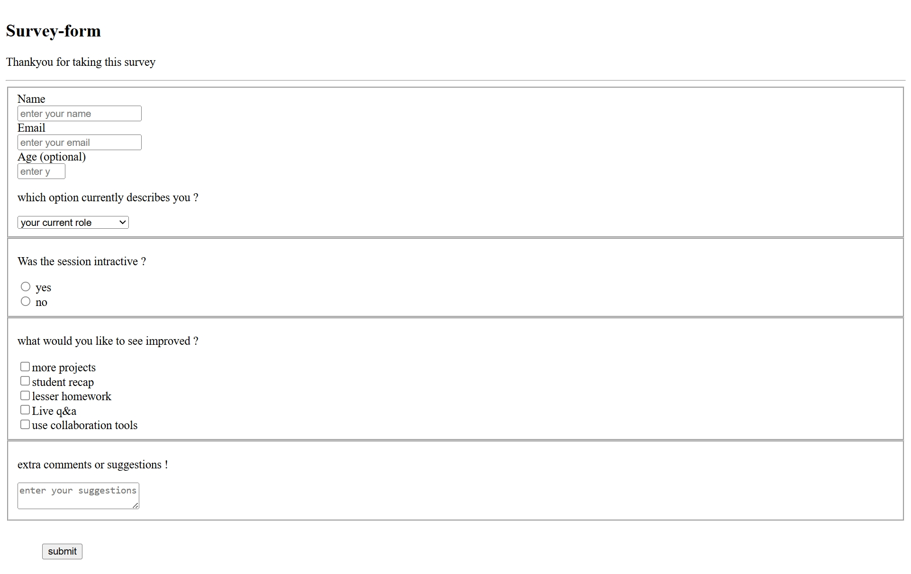

# 📝 Project 4 – Survey Form

#[live@](https://vssurvey.netlify.app/)

This project is a simple **HTML-based Survey Form** designed to collect user feedback and information.  
It demonstrates the use of essential HTML form elements such as input fields, dropdowns, checkboxes, radio buttons, and text areas — making it ideal for beginners learning form handling in web development.

---

## 🌟 Project Overview

The survey form allows users to:
- Enter their **name**, **email**, and **age**
- Select their **current role**
- Answer whether the session was interactive
- Provide feedback on what can be improved
- Share **additional comments or suggestions**

---

## 🧩 Features

- 🧑‍💻 **Input Fields:** Collects name, email, and age  
- 🔽 **Dropdown Menu:** Allows selection of user role (HTML, CSS, or JavaScript professional)  
- 🔘 **Radio Buttons:** Gathers yes/no responses for session interactivity  
- ☑️ **Checkboxes:** Lets users select multiple improvement suggestions  
- 💬 **Textarea:** For open-ended feedback and comments  
- 🖱️ **Submit Button:** For form submission (non-functional placeholder in this version)

# project screenshot
